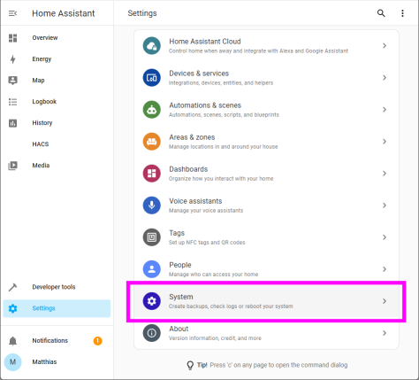
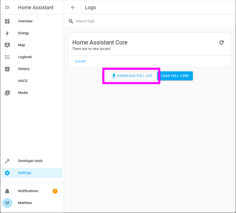

# What to do when you are requested to provide DEBUG log information?

There are __four steps__ that you need to do in order to provide debug log information 

This short guide can be used for all my integrations:
- ha-senec-v3
- ha-waterkotte
- ha-tibber-pulse-local
- ha-goecharger-api2

## 1) Enable Debug logging for the corrersponding integrations

Open your home assistant `configurationl.yaml` and edit/add the `logging` section as shown below:

```
logger:
  default: warning
  logs:
    custom_components.senec: debug
    custom_components.waterkotte_heatpump: debug
    custom_components.tibber_local: debug
    custom_components.goecharger_api2: debug
```

After you modified your configuration.yaml you need to restart home assistant. 

## 2) Reproduce the issue... 

Now you should perform the operation that cause the issue you would like to report - once you ae sure that the error/problem has occurred you can continue

## 3) Download Home Assistant Logs

There are three simple steps to navigate to your logs in home assistant from the Settings

### Open System Settings


### Open Logs


### Press 'Download Full Log'


## 4) Provide the log
Since home assistant log files __can contain sensitive data__ you might not like to share the content here in github.

So yo might like to go through the log file (with a simple text editor) and removing sensitive data before you share the log.

Instead of posting the log in a github issue you can also eMail me the logs - you find my contact data at [my profile on the main page](https://github.com/marq24).
